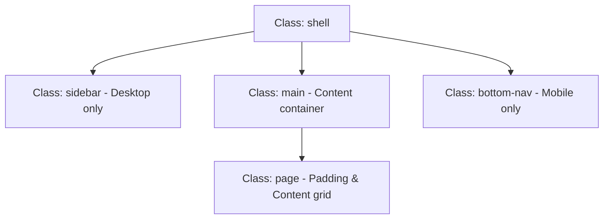

# AP Vidyuth — Design System

This document outlines the core design tokens, typography, structural layout patterns, interactive components, forms, and responsive design guidelines of AP Vidyuth.

---

## 1. Core Tokens & Themes
AP Vidyuth uses CSS custom properties to support light (default) and dark themes, featuring a refined **Dark Slate + Indigo** SaaS-inspired aesthetic.

### Typography
* **Primary Font (`--font`)**: `'Plus Jakarta Sans', ui-sans-serif, system-ui, sans-serif`
* **Monospace Font (`--mono`)**: `'JetBrains Mono', 'Fira Code', monospace`
* **Scale**: Mapped base sizing where `16px` equals `1rem`. Font size declarations use responsive clamps and rem values to ensure clean scalability on mobile webviews and accessibility platforms.

### Colors

| Variable | Light Theme (Default) | Dark Theme | Purpose |
| :--- | :--- | :--- | :--- |
| `--bg` | `#f8fafc` | `#0c0e14` | Primary body background |
| `--bg-2` | `#ffffff` | `#111318` | Sidebar/nav backgrounds |
| `--bg-3` | `#f9fafb` | `#161920` | Secondary page elements |
| `--surface` | `#ffffff` | `#1a1d26` | Card backgrounds |
| `--surface-2` | `#f1f5f9` | `#1f2230` | Inner structures |
| `--surface-3` | `#e2e8f0` | `#252839` | Borders/elevated panels |
| `--border` | `rgba(15, 23, 42, 0.05)` | `rgba(255,255,255,0.06)` | Subtle borders |
| `--border-md` | `rgba(15, 23, 42, 0.10)` | `rgba(255,255,255,0.10)` | Medium boundaries |
| `--border-hi` | `rgba(15, 23, 42, 0.16)` | `rgba(255,255,255,0.16)` | High-contrast boundaries |
| `--text-1` | `#0f172a` | `#f0f2f8` | Primary text and headings |
| `--text-2` | `#475569` | `#a0a5b8` | Secondary paragraph body |
| `--text-3` | `#64748b` | `#7d8396` | Muted/placeholder/hint labels |
| `--primary` | `#4f46e5` | `#6366f1` | Primary theme color (Indigo) |
| `--primary-hi` | `#6366f1` | `#818cf8` | Hover/active accent color |
| `--primary-dim` | `rgba(79,70,229,0.12)` | `rgba(99,102,241,0.12)`| Accent backgrounds |
| `--primary-glow`| `rgba(79,70,229,0.30)` | `rgba(99,102,241,0.30)`| Subtle selection borders/glows |

### Semantic Badges (Status Alerts)

| Semantic Role | Light (BG / FG) | Dark (BG / FG) |
| :--- | :--- | :--- |
| **Due Bills** (`--badge-due`) | `#fee2e2` / `#e11d48` | `rgba(225, 29, 72, 0.15)` / `#fda4af` |
| **Paid Bills** (`--badge-paid`) | `#d1fae5` / `#059669` | `rgba(5, 150, 105, 0.15)` / `#6ee7b7` |
| **No Dues** (`--badge-nodues`) | `#d1fae5` / `#059669` | `rgba(5, 150, 105, 0.15)` / `#6ee7b7` |
| **Unknown** (`--badge-unknown`) | `#f1f5f9` / `#475569` | `rgba(148, 163, 184, 0.15)` / `#cbd5e1` |

### Misc Sizing & Shadows
* **Border Radii**:
  * `--radius-sm`: `8px`
  * `--radius`: `12px`
  * `--radius-lg`: `16px`
  * `--radius-xl`: `20px`
* **Box Shadows**:
  * `--shadow`: `0 1px 3px 0 rgba(0, 0, 0, 0.1), 0 1px 2px -1px rgba(0, 0, 0, 0.1)` (or `0 4px 16px rgba(0,0,0,0.35)` in dark theme)
  * `--shadow-lg`: `0 10px 15px -3px rgba(0, 0, 0, 0.1)` (or `0 12px 40px rgba(0,0,0,0.5)` in dark theme)

---

## 2. Layout Structure (Shell)
AP Vidyuth uses a multi-layout shell that adapts to screens seamlessly.

* **Desktop Sidebar (`.sidebar`)**: Fixed width (`224px` / `196px` on tablet), containing logo, branding, nav links, and developer footer.
* **Mobile Bottom Nav (`.bottom-nav`)**: Fixed height (`56px` + env safe areas) anchored to the bottom edge. Automatically hidden when a modal is open.
* **Main Area (`.main`)**: Fills remaining space, handles scrollable areas cleanly, and hides webkit scrollbars.
* **Page Wrapper (`.page`)**: Standard padding (`24px` on desktop, `16px 12px 24px` on mobile).
  * **Sticky Header (`.page__header--sticky`)**: Bleeds out to page boundaries and overlays a `12px` blur backdrop.

---

## 3. Core Components

### 3.1 Buttons (`.btn`)
Standard action elements. All buttons use scaling transforms (`scale(0.97)`) on activation.

* **Primary (`.btn--primary`)**: High-contrast block color with indigo theme backgrounds.
* **Secondary (`.btn--secondary`)**: Subtle surface buttons with light boundary borders.
* **Ghost (`.btn--ghost`)**: Transparent container that shifts to surface fills on hover.
* **Danger (`.btn--danger`)**: Crimson background overlays with high-contrast text.
* **Micro/Icon Button (`.icon-btn` / `.icon-btn-micro` / `.icon-btn-ghost`)**:
  * `.icon-btn`: `32px` square wrapper, shifts background on hover.
  * `.icon-btn-micro`: Padding offset for smaller elements.
  * `.icon-btn-ghost`: Circular border-free clickable icons.

### 3.2 Service Card (`.scard`)
The main interactive component containing account tracking details.

* **Elevation & Borders**: Adapts border-color changes and translations (`translateY(-1px)`) on hover.
* **Status Stripe**: Removes top gradient colors in favor of `.soft-badge` and status-dot configurations (`.scard__status-dot--due`, `.scard__status-dot--paid`, etc.).
* **Hero Content (`.scard__hero-main`)**: Triggers expanded details and features a scaling interactive QR holder.
* **Quick Metrics (`.scard__quick-metrics`)**: Display grid containing basic service numbers and metadata.

### 3.3 Accordions & Panels
* **Accordion (`.acc`)**: Standard container shifting borders when `.acc--open` is active.
* **Breakup Panel (`.bp`)**: Split layout listing specific charge details.
  * `.bp__bar`: Colored segment stripe displaying charge weights.
  * `.bp__row--sub` & `.bp__row--net`: Segmented sub-charges and highlighted final nets.
* **Payments Panel (`.pymt`)**: Layout containing transaction lines and reference numbers.

### 3.4 Banners & Toasts
* **Install Banner (`.install-banner`)**: Instantly overlays a premium call-to-action on the screen (centered at the bottom on desktop, spanning screen edges on mobile).
* **Toast Container (`.toast-container`)**: Floating notifications container positioned `64px` from bottom to keep mobile tab bars uncovered.

---

## 4. Forms & Fields

* **Input Field (`.field`)**: Vertical stack pairing label text with input/selection wrappers.
* **Field Labels (`.field__label`)**: Small, uppercase bold text utilizing tracking and muted text colors.
* **Standard Inputs (`.field__input`)**: `42px` height block inputs with focus border transitions. Includes custom variants for:
  * Monospaced text formatting (`.field__input--mono`)
  * Validation errors (`.field__input--error` / `.field__input` with `--red` border)
* **Segmented Controls (`.seg`)**: Nested control sliders supporting tab switches (`.seg__btn--active`).

---

## 5. Layout Utilities & Responsive Breaks
* **Media Query Breakpoints**:
  * **Tablet (`1024px`)**: Switches stats grids to 2 columns and collapses sidebar width to `196px`.
  * **Mobile Portal (`700px`)**: Hides Sidebar, displays Bottom Nav, switches standard buttons to a touch-friendly `44px` height, and stretches the card grid into single-row listings.
  * **XS Mobile (`460px` / `360px`)**: Toggles responsive helper visibility flags (`.show-xs`, `.show-mobile-sm`).
* **Density Mode (`.shell--compact`)**: Overrides paddings, shrinks typography scales, and reduces card dimensions to fit higher densities.
